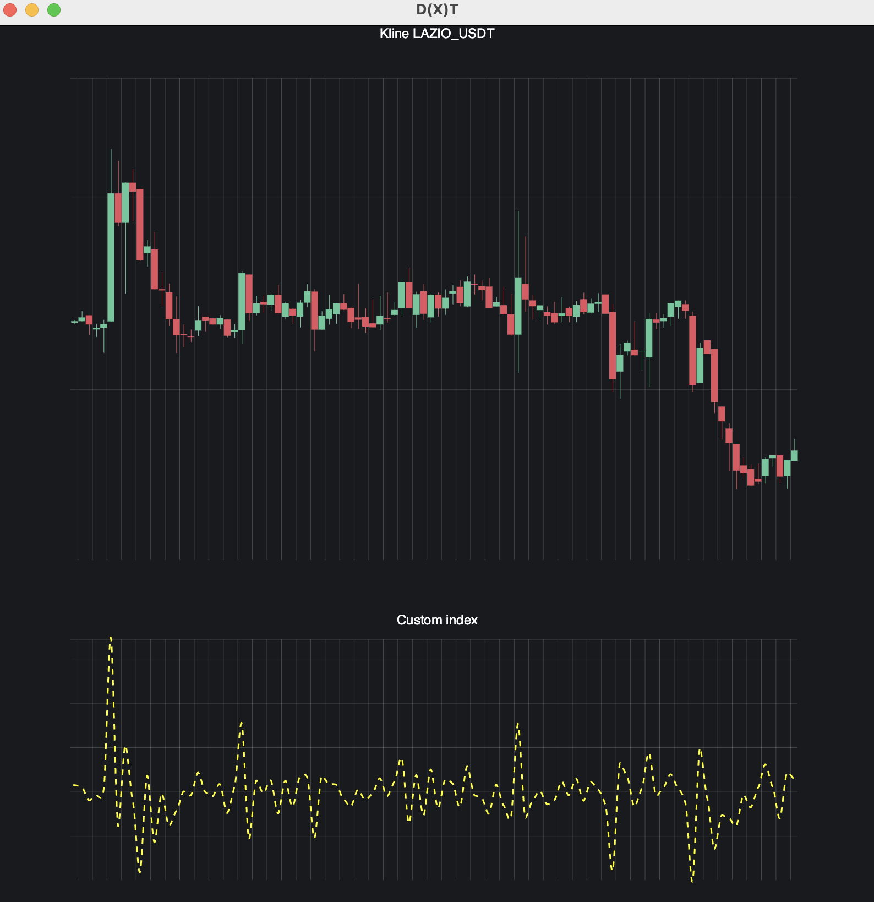

# WORK IN PROGRESS

This is a library for personal use, feel free to peek into the code or to collaborate

## Latest state

## Features

- Vertical and horizontal zoom
- Scrolling
- Displaying data from start or end
- Kline drawing
- Line drawing
- Points drawing
- Grid background
- Multiple plots with shared navigation
- Partial rendering - calculates what can be seen on screen before fetching the data
- Displaying prices of last visible kline / line
- Grid with prices

## Plans

- Hover element
- Callbacks and data updates